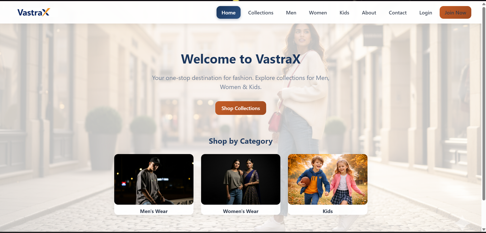
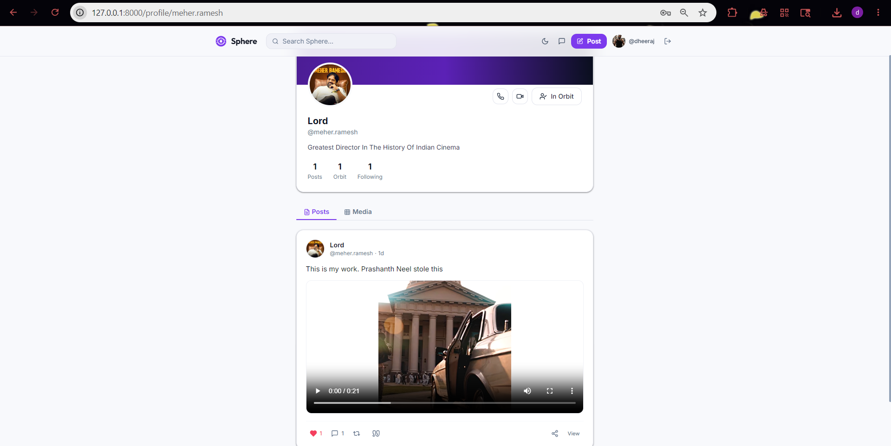
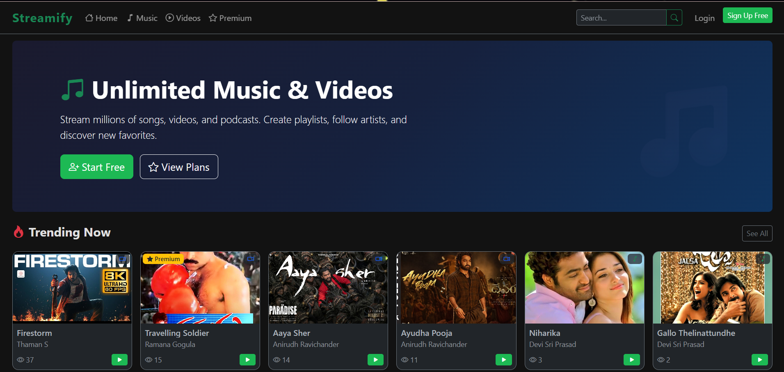

<!-- Header -->

  

<!-- Introduction -->

  <h1>👋 Hi, I'm Dheeraj Nalluri</h1>
  <h3>Backend Developer | Cloud Solutions Architect, from India 🇮🇳</h3>

  
  
  
  

<!-- GitHub Snake -->

  <picture>
    <source media="(prefers-color-scheme: dark)" srcset="https://raw.githubusercontent.com/nalluridheeraj/nalluridheeraj/output/github-contribution-grid-snake-dark.svg">
    <source media="(prefers-color-scheme: light)" srcset="https://raw.githubusercontent.com/nalluridheeraj/nalluridheeraj/output/github-contribution-grid-snake.svg">
    
  </picture>

<!-- About -->

  <h2>👨‍💻 About Me</h2>
  

    🎓 4th-year <b>B.Tech Computer Science and Engineering</b> student at Lovely Professional University 
    ☁️ Specializing in <b>Cloud Computing</b> and <b>Backend Development</b> 
    💻 Focused on building scalable, production-ready backend systems 
    🌱 Currently exploring <b>AWS</b>, <b>Azure</b>, and container orchestration with <b>Docker/Kubernetes</b>
  

<!-- Technologies -->

  <h2>💻 Tech Stack</h2>

  #### Languages & Frameworks
  

  #### Frontend & Design
  

  #### Databases
  

    
    
  

  #### Cloud & Tools
  

<!-- Projects Section -->

  <h2>🚀 Featured Projects</h2>

  <table>
    <tr>
      <td align="center">
         
        <b>VastraX</b> 
        Fashion E-Commerce Platform
      </td>
      <td align="center">
         
        <b>Sphere</b> 
        Sovereign Mini Social Media
      </td>
      <td align="center">
         
        <b>Streamify</b> 
        Cloud Media Streaming Platform
      </td>
    </tr>
  </table>

<!-- Social Media -->

  <h2>🌐 Connect With Me</h2>

  
  
  
  

<!-- Contributions -->

  <h2>🤝 How to Reach Out</h2>

  🔍 Browse my projects
  🐛 Report bugs
  💡 Suggest improvements
  🌟 Star the repos you like

<!-- GitHub Stats -->

  <h2>📊 GitHub Stats</h2>

  <!-- GitHub Stats Card -->
  

  <!-- Most Used Languages -->
  

  <!-- GitHub Activity Graph -->
  

<!-- Footer -->

  
🤝 Open to collaborations and new opportunities

